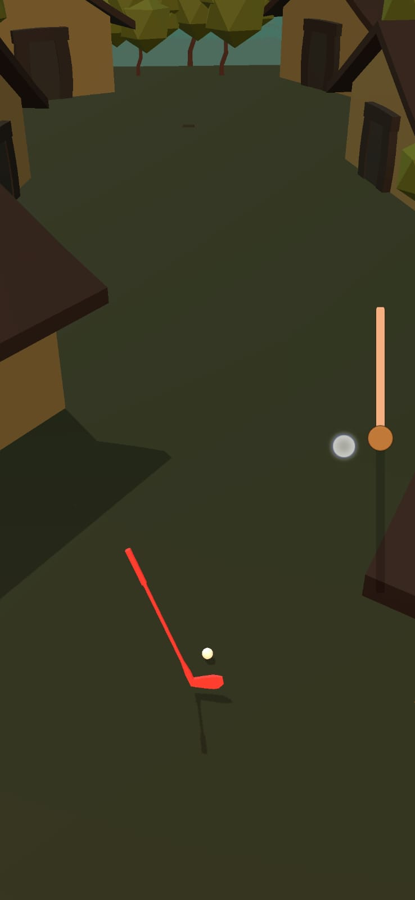

# Golf Box

# Unity Ball Game Project

This repository contains a simple ball game project built with Unity. The game involves controlling a ball using a stick to navigate through different stages. The project consists of several scripts and game objects to handle various functionalities.

## How to Play

1. Launch the game.
2. Use the slider to control the stick's angle.
3. Release the slider to hit the ball.
4. The ball should navigate through the stage until it collides with the target object.
5. Upon collision, the game will load the next stage.

## Script Summaries

### BallVelocityHandler.cs

- Handles the ball's velocity and stick placement.
- Stops the ball and positions the stick after a specific time.

### FallDetector.cs

- Detects when the ball falls.
- Resets the ball's position and rotation upon falling.

### FollowTheDamnBallCJ.cs

- Makes an object follow the ball's position.

### HitWithHandle.cs

- Controls the stick's behavior, including the hit response and stick rotation.
- Allows the player to hit the ball with different force using a slider.

### LookAround.cs

- Enables the player to look around using touch input.

### Scenes.cs

- Loads the next stage when the ball collides with the target object.

## Media

